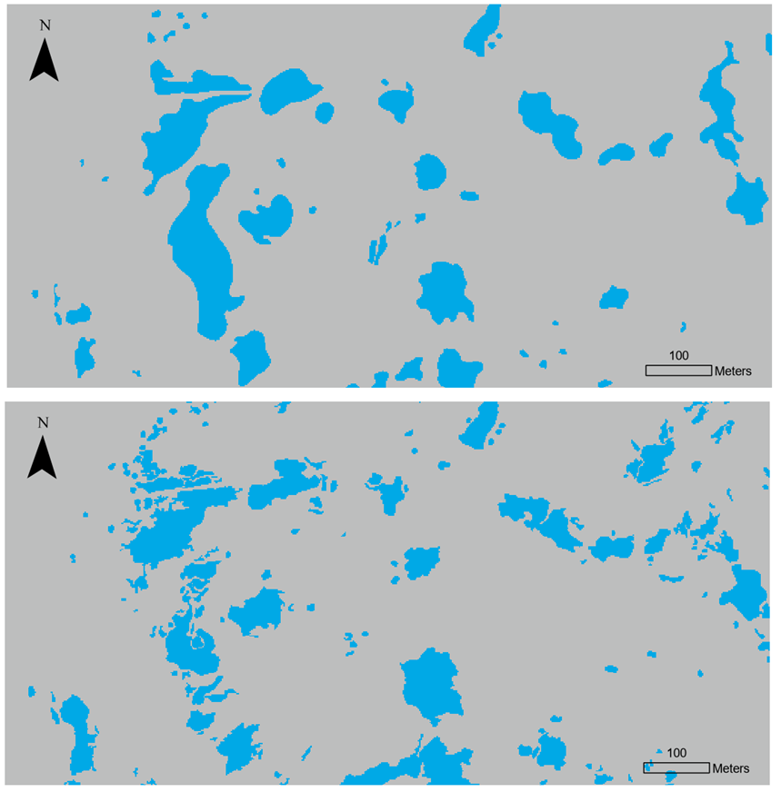
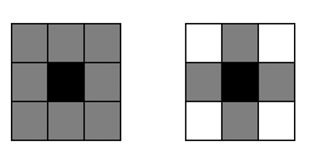
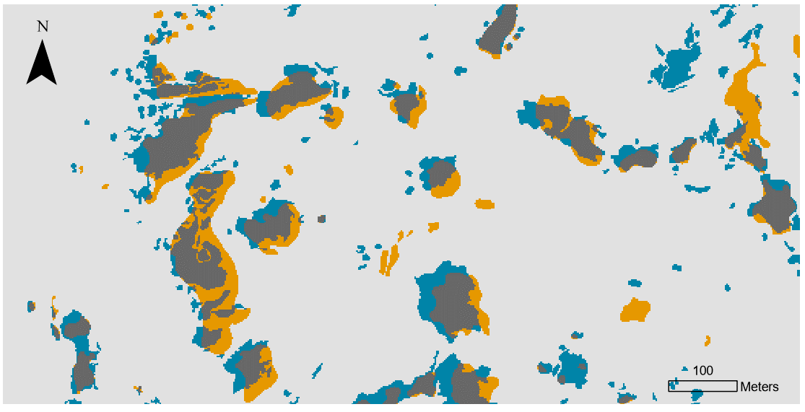
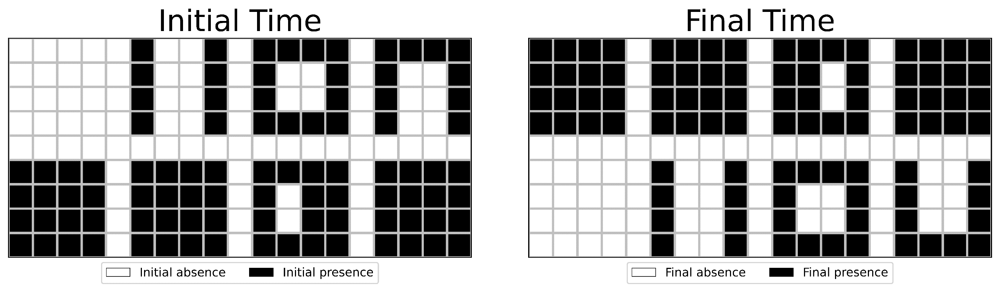
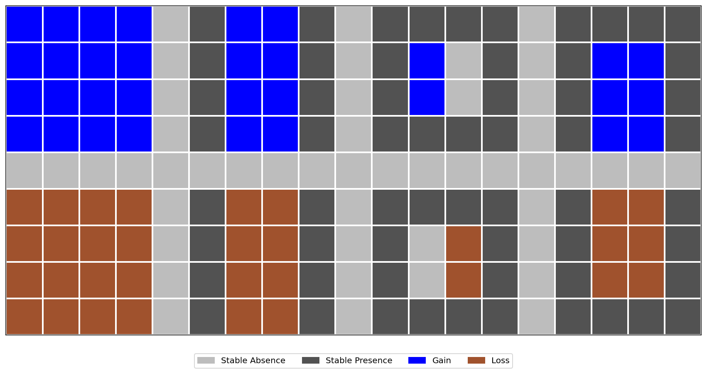
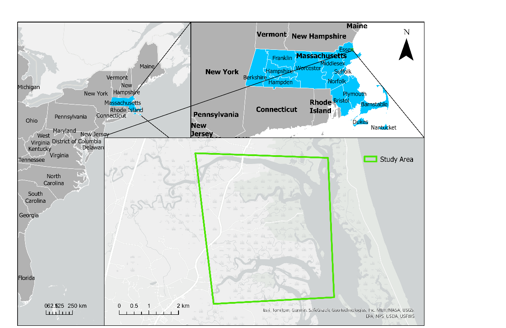
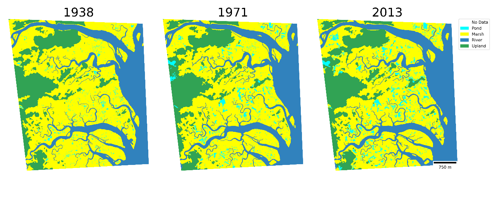
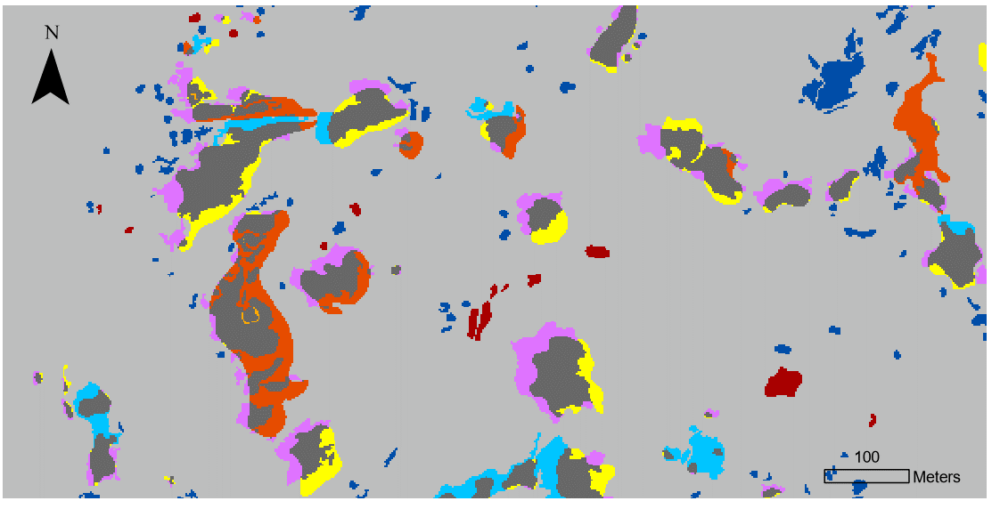
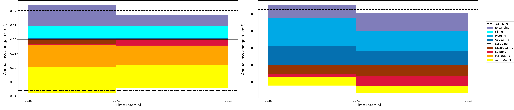
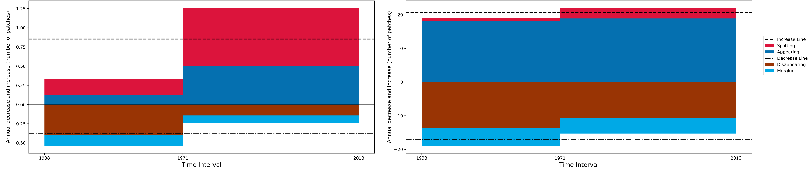

## Intro

:::: columns

::: {.column width="42%"}
How would you analyze the change patterns of ponds in these maps?

- **Pixel-based:** change per pixel
- **Patch-based:** change per connected patch
:::

{width="553"}

Data source: Environmental Data Initiative, knb-lter-gce.657.6
::::

## Defining a patch 

## What is a patch?

::::: columns
::: {.column width="58%"}
{fig-alt="The same pixels form different patches under four- and eight-neighbour connectivity"}
:::

::: {.column width="42%"}
Two ways to define **connected** pixels:

- **8-connectivity:** edges or corners touch
- **4-connectivity:** edges touch

The choice changes the number and geometry of patches.
:::
:::::

## Overlay shows change—but which patch transition?

::::: columns
::: {.column width="56%"}
{fig-alt="Overlay of pond maps showing stable absence, stable presence, gain, and loss"}
:::

::: {.column width="44%"}
GIS map overlays identify:

- Stable absence
- Stable presence
- Gain
- Loss

**How do we explicitly characterize the dynamic transition patterns of a target land cover?**
:::
:::::

## Net zero can hide complete reorganization

{fig-alt="Designed example with equal presence totals at the initial and final times"}

:::::: metric-row
::: metric
Initial and final presence [92 pixels]{.value}
:::

::: metric
Initial and final patch count [8 patches]{.value}
:::

::: metric
Net change [0]{.value}
:::
::::::

The overlay still contains **64 change pixels** in **8 change patches**.

## Eight transition types

::::::: columns
:::: {.column .transition-type-column width="50%"}
::: transition-label
Gain
:::

- **Appearing:** 0 connected initial presence patches → increase
- **Merging:** more than 1 → decrease
- **Filling:** 1 and no exterior absence → no gross count change
- **Expanding:** 1 and exterior absence remains → no gross count change
::::

:::: {.column .transition-type-column width="50%"}
::: transition-label
Loss
:::

- **Disappearing:** 0 connected final presence patches → decrease
- **Splitting:** more than 1 → increase
- **Perforating:** 1 and no exterior absence initially → no gross count change
- **Contracting:** 1 and exterior absence exists → no gross count change
::::
:::::::

::: small-note
The eight types are mutually exclusive and collectively exhaustive.
:::

## Gross change in area

::::: columns
::: {.column width="55%"}
{fig-alt="Designed transition example coloured by stable presence, stable absence, gain, and loss"}
:::

::: {.column width="45%"}
**Gross gain = 32 pixels**

- Appearing 16 · Merging 8
- Filling 2 · Expanding 6

**Gross loss = 32 pixels**

- Disappearing 16 · Splitting 8
- Perforating 2 · Contracting 6
:::
:::::

## Gross change in patch count

**Union patch:** the union of initial presence and final presence.

For each union patch:

$$\Delta N = N_{\text{final presence}} - N_{\text{initial presence}}$$

:::::: metric-row
::: metric
Gross increase [+2]{.value} Appearing + splitting
:::

::: metric
Gross decrease [−2]{.value} Disappearing + merging
:::

::: metric
Net change [0]{.value} Gross changes cancel
:::
::::::

## PIE-LTER case study

::::: columns
::: {.column width="45%"}
{fig-alt="Map locating the PIE-LTER study area on the northeastern United States coast"}
:::

::: {.column width="55%"}
{fig-alt="PIE-LTER land-cover maps for 1938, 1971, and 2013"}
:::
:::::

Targets: **marsh** and **pond** across 1938, 1971, and 2013.

## Spatially explicit transition maps

{fig-alt="PIE-LTER transition map showing stable classes and eight DynamicPATCH transition types" width="70%" style="display:block;margin:0 auto;"}

{fig-alt="Legend for the two stable classes and eight DynamicPATCH transition types" width="68%" style="display:block;margin:0 auto;"}

Each interval map contains the two stable types and eight transition types.

## Gross area change is larger than net change

{fig-alt="Annual gross area change charts for PIE-LTER marsh and pond"}

- Pond gross gains are more than twice the gross losses.
- Perforating + contracting account for **89%** of marsh gross loss.
- Expanding + filling account for **94%** of marsh gross gain.

## Gross patch-count change is larger than net change

::::: columns
::: {.column width="62%"}
{fig-alt="Annual gross patch count change charts for PIE-LTER marsh and pond"}
:::

::: {.column width="38%"}
- Appearing + disappearing dominate pond patch-count change.
- Pond gross change is **10×** net change.
- Marsh gross increase in the second interval is **3.8×** the first.
:::
:::::

For pond patches, 1938–1971 has **631 gross increases + 631 gross decreases = 1,262 changes**, while net change is **0**.

## Applications and challenges

::::: columns
::: {.column width="50%"}
### Potential applications

- Urban expansion, disturbance, and forest fragmentation
- Connecting patterns to drivers and impacts
- Habitat fragmentation and connectivity
- Map comparison and land-change modelling
- Any categorical maps with more than one time point
:::

::: {.column width="50%"}
### Challenges

- Border effects
- Sensitivity to 4- versus 8-connectivity
- Noise and isolated pixels
- Computational cost
:::
:::::

## Live demonstration: VCR marsh, 1985–2021

``` python
results = dynamicpatch.run_dynamicpatch(
    workpath=str(data_dir),
    year=[1985, 2021],
    in_nodata=255,
    connectivity=8,
    targ_pre=2,
    unit="km2",
    res=30,
    map_show=True,
    chart_show=True,
    export_map=str(output_dir / "VCR_marsh_transition"),
)
```

**Open `dynamicpatch-demo.ipynb` and run all cells.**

::: citation
Zhang et al. 2025. “DynamicPATCH: Method and Software for Spatially Explicit Dynamic Patch Transition Characterization.” Landscape Ecology 40 (7): 132. https://doi.org/10.1007/s10980-025-02120-1
:::